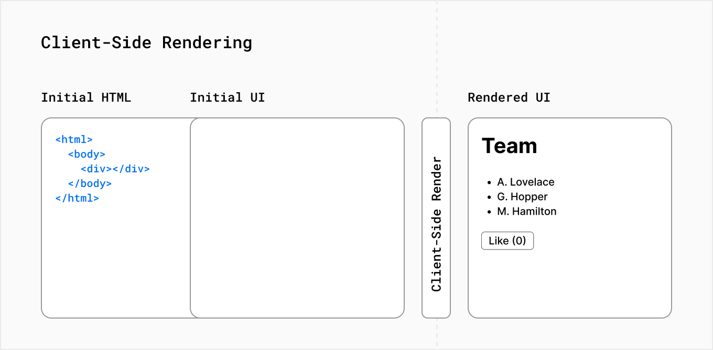
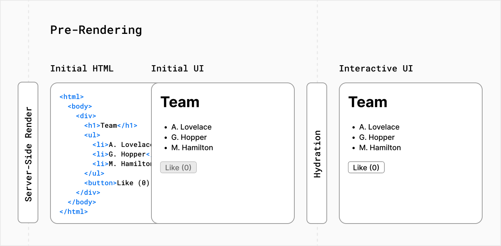

# 렌더링이란?

- react로 작성한 코드를 HTML로 변환하기 위한 작업 단위를 말함
- 렌더링은 서버나 클라이언트에서 발생할 수 있으며, 빌드 타임에 미리 수행하거나 런타임에 수행할 수도 있음
- next js는 CSR, SSR, SSG를 사용

### React는 기본적으로 CSR(Client Side Rendering)

- 빈 HTML과 자바스크립트를 서버로부터 받아 클라이언트 측에서 렌더링



### Nextjs는 기본적으로 모든 페이지를 pre-render

- SSG(Static Site Generation) 방식: 빌드 타임에 HTML을 생성하여 매 요청마다 이를 재사용
- SSR(Server Side Rendering) 방식: 매 요청마다 HTML을 생성하여 사용

⇒ 즉 서버에서 HTML을 미리 생성하는 것을 의미!

⇒ 서버에서 JS, HTML 파일을 모두 로딩해서 하나의 HTML파일로 클라이언트에게 준다면 사용자 상호작용을 위한 이벤트 처리는 어떻게?? ⇒ hydration을 통해 문제를 해결!

# SSR, Hydration을 거쳐 사용자 브라우저 까지



1. SSR

   - 서버 측에서는 초기 페이지 로드 시에 애플리케이션 컴포넌트들을 생성하여 HTML로 렌더링
   - 이때, 컴포넌트들은 브라우저에서 렌더링될 때와 동일한 구조로 생성
   - 이렇게 생성된 HTML은 브라우저로 전달되어 초기 페이지 컨텐츠로 사용

   ⇒ 사실, SSR은 각 요청에 대한 페이지의 HTML을 서버에서 생성하고 클라이언트에게 “HTML 파일 + JSON 데이터 + 페이지 상호작용을 위한 JS 명령어”를 줌

2. **클라이언트 측 렌더링과 Hydration**

   - 브라우저에서는 초기에 받은 HTML과 클라이언트 측에서 생성된 React 애플리케이션의 렌더링 결과를 비교
   - 이 비교를 통해 브라우저는 초기에 받은 HTML 구조를 이용하여 React 컴포넌트 트리를 재구성하고 이벤트 핸들러를 연결
   - 이 과정을 통해 브라우저는 새로운 컴포넌트 트리를 생성하지 않고 기존의 구조를 활용하여 렌더링을 초기화

   즉, HTML 파일: 비대화형 페이지를 빠르게 표시하는데 사용
   JSON 데이터와 JS 명령어: react가 컴포넌트를 대화형으로 만드는데 사용

# hydrateRoot

- `hydrateRoot`를 사용하면 이전에 `[react-dom/server](https://react-ko.dev/reference/react-dom/server)`로 생성한 HTML 콘텐츠가 있는 브라우저 DOM 노드 내에 React 컴포넌트를 표시할 수 있습니다.
- `hydrateRoot`를 호출하여 서버 환경에서 React가 이미 만들어둔 HTML에 React를 “붙입니다”.
  ```jsx
  import { hydrateRoot } from 'react-dom/client';

  // domNode = 서버에서 루트 엘리먼트로 렌더링된 DOM element
  const domNode = document.getElementById('root');

  // reactNode = 앞서 존재하는 HTML에 렌더링하기 위한 React노드
  const root = hydrateRoot(domNode, reactNode);
  ```
  ```jsx
  import { hydrateRoot } from 'react-dom/client';

  hydrateRoot(document.getElementById('root'), <App />);
  ```
  - 서버 HTML을 브라우저 DOM 노드에서 React 컴포넌트를 이용해 hydrate함, 프레임워크를 사용중이라면 프레임워크가 알아서 실행

### hydrate 과정

```jsx
// SSR을 통해 만들어진 html
<div id="root">
	<h1>Hello, world!</h1>
	<button>You clicked me <!-- -->0<!-- --> times</button>
</div>
```

```jsx
// App.js
import { useState } from 'react';

export default function App() {
  return (
    <>
      <h1>Hello, world!</h1>
      <Counter />
    </>
  );
}

function Counter() {
  const [count, setCount] = useState(0);
  return (
    <button onClick={() => setCount(count + 1)}>
      You clicked me {count} times
    </button>
  );
}
```

```jsx
// index.js
import './styles.css';
import { hydrateRoot } from 'react-dom/client';
import App from './App.js';

hydrateRoot(document.getElementById('root'), <App />);
```

# React Hydration 장점

- 사용자에게 초기 로딩 속도를 빠르게 제공하면서도 상호 작용 가능한 컴포넌트를 사용 가능
- SSR과 CSR의 장점을 결합하여 SEO와 성능을 개선
- 이전에 렌더링된 컴포넌트 상태와 이벤트 핸들러를 유지하여 사용자 경험을 최적화

요약하면, React Hydration은 서버 사이드 렌더링된 HTML과 클라이언트 측 React 애플리케이션의 렌더링 결과를 조합하여 초기 로딩 속도와 사용자 경험을 최적화하는 프로세스를 말함
