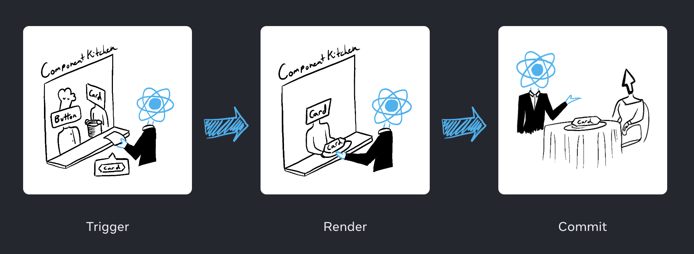
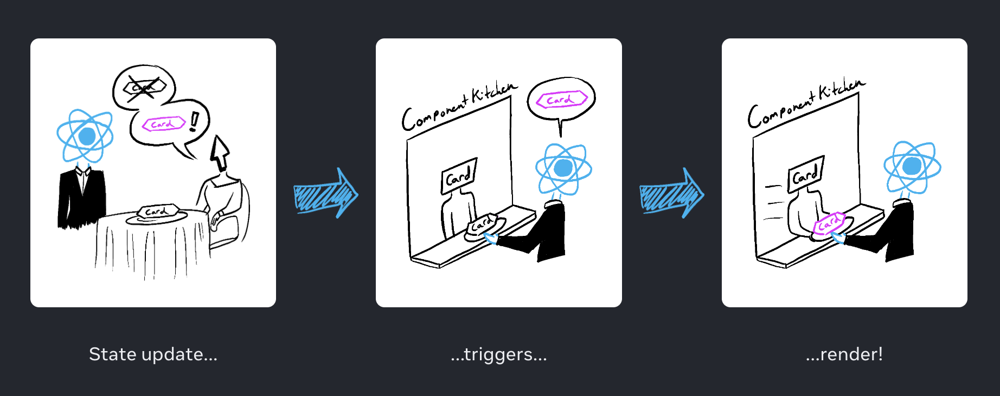

# Render and Commit

React는 웨이터!
컴포넌트는 주방의 요리사!

UI를 요청하고 제공하는 세 가지 스텝으로 이루어진다.

1. 렌더 트리거 (Trigger)
2. 컴포넌트 렌더링 (Render)
3. DOM에 커밋 (Commit)



## 1. 렌더 트리거

컴포넌트가 렌더링되는 이유는 두 가지가 있다.

1. 컴포넌트의 초기 렌더
2. 컴포넌트 (또는 상위 컴포넌트)의 상태 업데이트

### 초기 렌더

타겟 DOM 노드인 `createRoot`를 호출하고 컴포넌트의 `render` 메서드를 호출하면서 이루어진다.

```jsx
import Image from "./Image.js";
import { createRoot } from "react-dom/client";

const root = createRoot(document.getElementById("root"));
root.render(<Image />);
```

### 상태가 업데이트될 때 재렌더링

컴포넌트의 초기 렌더 이후 **set function**과 함께 상태 업데이트를 하면서 렌더를 트리거할 수 있다.



## 2. 컴포넌트 렌더링

렌더 트리거 이후 리액트는 화면에 어떻게 보일지 구성된 컴포넌트를 호출한다.
**렌더링은 리액트가 컴포넌트를 호출하는 것을 의미한다.**

- 초기 렌더링에서 리액트는 **루트 컴포넌트**를 호출한다.
- 하위 렌더링에서 리액트는 렌더링이 트리거된 **함수 컴포넌트의 상태 업데이트**를 호출한다.

이러한 과정은 **재귀적**이다.

> 부모 컴포넌트의 렌더링이 자식 컴포넌트의 렌더링에도 영향을 미치는 이유!

다음 예를 살펴보자.

```jsx
export default function Gallery() {
  return (
    <section>
      <h1>Inspiring Sculptures</h1>
      <Image />
      <Image />
      <Image />
    </section>
  );
}

function Image() {
  return (
    
  );
}
```

- 초기 렌더링에서 리액트는 `<section>`, `<h1>`, `` 태그에 대한 DOM 노드들을 생성한다.
- 리렌더링에서 리액트는 이전 렌더링 이후 변경된 속성을 계산한다. 다음 단계인 커밋 단계까지는 이 정보로 아무것도 수행하지 않는다.

## 3. DOM에 커밋

컴포넌트 렌더링(호출) 이후 리액트는 DOM을 수정한다.

> render 단계가 아닌 commit 단계에서 DOM의 수정이 일어난다!

- 초기 렌더에서 리액트는 `appendChild()` DOM API를 사용하여 생성한 DOM 노드들을 화면에 표시한다.
- 리렌더링에서 리액트는 최신 렌더링 출력과 일치하도록 필요한 최소한의 동작(렌더링하면서 계산된)만을 적용한다.

**리액트는 오직 렌더링 간에 차이가 발생할 때만 DOM 노드를 변경한다.**

다음 예제는 부모 컴포넌트로부터 매초 다른 `props`와 함께 리렌더링하는 컴포넌트이다.
`<input>`에 텍스트를 추가하여 `value`를 업데이트해도 컴포넌트가 재렌더링될 때 텍스트는 사라지지 않는다.

```jsx
export default function Clock({ time }) {
  return (
    <>
      <h1>{time}</h1>
      <input />
    </>
  );
}
```

## 에필로그: 브라우저 페인트

렌더링이 수행되고 리액트가 DOM을 업데이트한 후 브라우저는 화면을 다시 그린다.
이 과정은 "브라우저 렌더링"으로 알려져 있지만,
혼란을 피하기 위해 "페인팅"으로 부를 것이다.

리액트는 새로운 `time`의 `<h1>`의 내용만을 업데이트한다.
`<input>`은 지난번과 같은 장소에서 나타나서 리액트는 건드리지 않는다.

## 헷갈리기 쉬운 부분들

### 컴포넌트 호출

컴포넌트 호출은 Render Phase에서 실행된다.
이는 호출이 곧 화면 반영을 나타내는 것이 아님을 의미한다.

리렌더링된다는 말은 컴포넌트가 호출되고 그 결과가 Virtual DOM에 반영된다는 것이다.
DOM에 마운트되어 페인트된다는 것이 아니다.

## 참고 문서

- [Render and Commit](https://react.dev/learn/render-and-commit)
- [React 톺아보기 - 02. Intro](https://goidle.github.io/react/in-depth-react-intro/)
