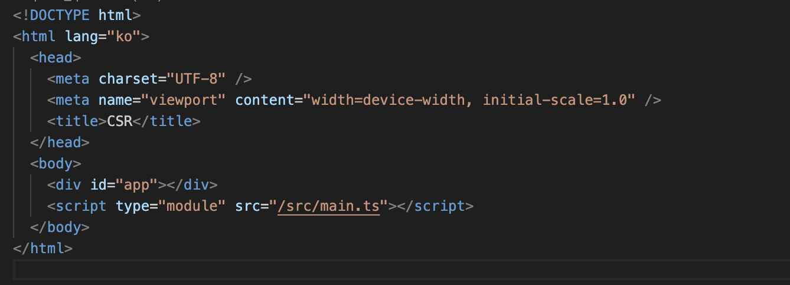

# SSR, CSR, SSG

## Pre-rendering

HTML을 언제 생성하는지 차이가 있다.

- Static Site Generator: HTML은 **빌드 시간**에 생성되고 매 요청마다 재사용된다. 미리 만드는 것이다!
- Server Side Rendering: HTML은 **매 요청**마다 생성된다. 요청 시에 만드는 것이다!

## Server Side Rendering (SSR)

HTML 페이지는 **매 요청**마다 생성된다.
페이지에서 자주 업데이트되는 데이터를 미리 저장해야 한다고 가정한다.

NextJs에서는 다음과 같은 방식으로 코드를 작성한다.

```jsx
export default function Page({ data }) {
  // Render data...
}

// This gets called on every request
export async function getServerSideProps() {
  // Fetch data from external API
  const res = await fetch(`https://.../data`);
  const data = await res.json();

  // Pass data to the page via props
  return { props: { data } };
}
```

`gertServerSideProps`의 함수에서 미리 데이터가 처리되는 것을 확인할 수 있다.

## Client Side Rendering (CSR)

브라우저는 최소한의 HTML 페이지와 페이지에 필요한 자바스크립트를 다운로드한다.
그 다음 자바스크립트를 사용하여 DOM을 업데이트하고 페이지를 렌더링한다.

이에 애플리케이션을 처음 로드할 때 완전한 페이지를 보기 전 약간의 딜레이가 발생하는 것이다.
모든 자바스크립트가 다운로드되고 파싱되고 실행되기 전까지 페이지는 완전히 렌더링되지 않는다.

페이지가 처음 로드된 후 웹사이트 내에서 다른 페이지로 이동하는 것은 일반적으로 빠르다.
이는 전체 페이지를 새로 고칠 필요없이 자바스크립트가 페이지의 일부만을 리렌더링하기 때문이다.

코드로 알아보자.

```jsx
import React, { useState, useEffect } from "react";

export function Page() {
  const [data, setData] = useState(null);

  useEffect(() => {
    const fetchData = async () => {
      const response = await fetch("https://api.example.com/data");
      if (!response.ok) {
        throw new Error(`HTTP error! status: ${response.status}`);
      }
      const result = await response.json();
      setData(result);
    };

    fetchData().catch((e) => {
      // handle the error as needed
      console.error("An error occurred while fetching the data: ", e);
    });
  }, []);

  return <p>{data ? `Your data: ${data}` : "Loading..."}</p>;
}
```

초기 로드에서 데이터가 존재하지 않는 경우도 고려해야 한다.

### SSR 방식과 CSR 방식의 비교

> CSR은 자바스크립트를 다운로드 받아 동적으로 페이지를 생성한다!

> SSR은 렌더링 준비를 마친 HTML과 자바스크립트를 생성하여 전달한다!

#### CSR 장점

- 서버 부하가 적다.
- 클라이언트에서 대부분의 작업을 처리하여 반응 속도가 빠르고 UX가 좋다.

#### CSR 단점

- 초기 페이지 로드 시간이 상대적으로 느리다.
- SEO에 친화적이지 않다.



#### SSR 장점

- SEO에 친화적이다.
- 자바스크립트를 다운로드 받기 전에 사용자가 화면을 볼 수 있다.

#### SSR 단점

- 자바스크립트를 다운로드 받기 전 화면은 껍데기에 불과하다.
- 서버 부하가 있다.

## Static Site Generator (SSG)

### 언제 사용해야 하는가?

가능한 SSG 방식을 사용하면 좋다.
페이지가 빌드 시 한 번만 생성되고 CDN에 의해 저장되어 빠르기 때문이다.

- 마케팅 페이지
- 블로그 포스트, 포트폴리오
- 상품 목록
- 도움말 및 문서화

헷갈리면 다음 질문을 던져보자.

> 사용자의 요청에 앞서 이 페이지를 미리 렌더링할 수 있을까?

다른 한편으로 사용자의 요청에 앞서 미리 렌더링할 수 없는 페이지, 즉 빈번하게 업데이트되는 데이터를 보여줘야 하는 페이지는 SSG가 좋은 선택이 될 수 없다.
이때 CSR, SSR을 고려한다.

### 나아갈 키워드

- hydration
- server component

## 참고 문서

- [Rendering](https://nextjs.org/docs/pages/building-your-application/rendering)
