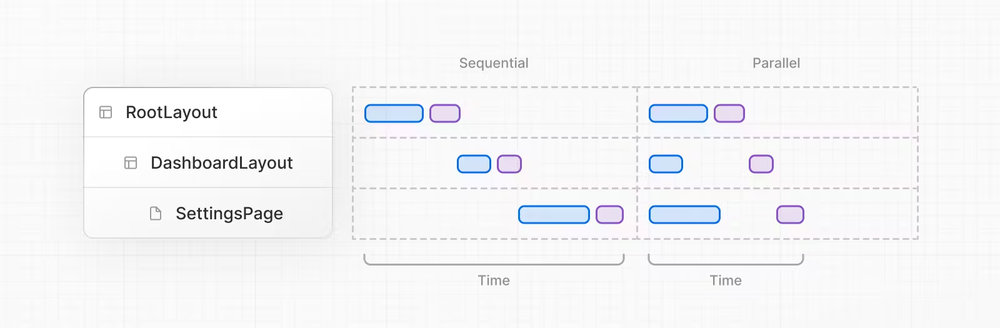
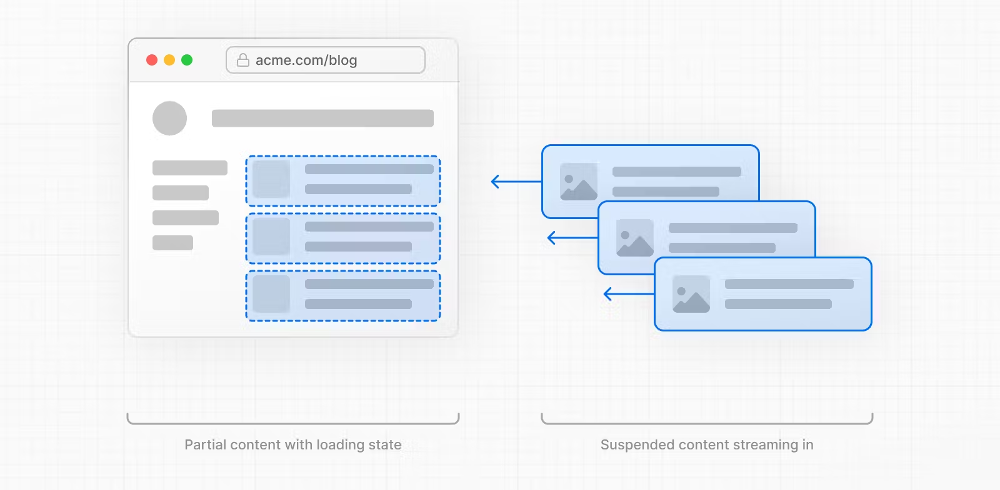

# 서버 컴포넌트란?

React 서버 컴포넌트(또는 RSC)는 React 팀에서 설계한 새로운 애플리케이션 아키텍처입니다.

우리는 미리 실행되고 자바스크립트 번들에서 제외되는 새로운 종류의 컴포넌트인 서버 컴포넌트를 도입하고 있습니다.

서버 컴포넌트는 빌드 중에 실행되어 파일 시스템에서 읽거나 정적 콘텐츠를 가져올 수 있습니다. 또한 서버에서 실행할 수 있으므로 API를 빌드할 필요 없이 데이터 레이어에 액세스할 수 있습니다.

서버 컴포넌트에서 브라우저의 대화형 클라이언트 컴포넌트로 프로퍼티를 통해 데이터를 전달할 수 있습니다.

RSC는 서버 중심 멀티 페이지 앱의 단순한 '요청/응답' 멘탈 모델과 클라이언트 중심 싱글 페이지 앱의 원활한 상호 작용을 결합하여 두 가지 장점을 모두 제공합니다.

- [출처: React Dev Blog](https://react.dev/blog/2023/03/22/react-labs-what-we-have-been-working-on-march-2023#react-server-components)

React 서버 컴포넌트를 사용하면 서버에서 렌더링하고 선택적으로 캐시할 수 있는 UI를 작성할 수 있습니다. Next.js에서는 렌더링 작업을 경로 세그먼트별로 더 분할하여 스트리밍 및 부분 렌더링을 가능하게 하며, 세 가지 서버 렌더링 전략이 있습니다

- Static Rendering
- Dynamic Rendering
- Streaming

# 서버 컴포넌트의 장점

## Data Fetching

서버 컴포넌트를 사용하면 데이터 가져오기를 데이터 소스에 더 가까운 서버로 옮길 수 있습니다. 이렇게 하면 렌더링에 필요한 데이터를 가져오는 데 걸리는 시간과 클라이언트가 요청해야 하는 양을 줄여 성능을 향상시킬 수 있습니다.

## Security

서버 컴포넌트를 사용하면 토큰 및 API 키와 같은 민감한 데이터와 로직을 클라이언트에 노출할 위험 없이 서버에 보관할 수 있습니다.

## Caching

서버에서 렌더링하면 결과를 캐시하여 후속 요청 및 사용자 전체에서 재사용할 수 있습니다. 이렇게 하면 각 요청에서 수행되는 렌더링 및 데이터 가져오기 양을 줄여 성능을 개선하고 비용을 절감할 수 있습니다.

## Bundle Sizes

서버 컴포넌트를 사용하면 이전에는 클라이언트 자바스크립트 번들 크기에 영향을 미쳤던 대규모 종속성을 서버에 유지할 수 있습니다. 클라이언트가 서버 컴포넌트용 JavaScript를 다운로드, 구문 분석 및 실행할 필요가 없으므로 인터넷 속도가 느리거나 성능이 낮은 기기를 사용하는 사용자에게 유용합니다.

## Initial Page Load and First Contentful Paint

서버에서는 클라이언트가 페이지를 렌더링하는 데 필요한 JavaScript를 다운로드, 구문 분석 및 실행할 때까지 기다릴 필요 없이 사용자가 즉시 페이지를 볼 수 있도록 HTML을 생성할 수 있습니다.

## **Search Engine Optimization and Social Network Shareability**

렌더링된 HTML은 검색 엔진 봇이 페이지 색인을 생성하는 데 사용하고 소셜 네트워크 봇이 페이지에 대한 소셜 카드 미리보기를 생성하는 데 사용할 수 있습니다.

## **Streaming**

서버 컴포넌트를 사용하면 렌더링 작업을 청크로 분할하여 준비되는 대로 클라이언트로 스트리밍할 수 있습니다. 이를 통해 사용자는 서버에서 전체 페이지가 렌더링될 때까지 기다릴 필요 없이 페이지의 일부를 먼저 볼 수 있습니다.

# Server Component가 렌더링 되는 과정

서버에서 Next.js는 React의 API를 사용해 렌더링을 조정합니다. 렌더링 작업은 개별 경로 세그먼트와 서스펜스 (종길님이 발표하신 suspense)바운더리에 따라 청크로 분할됩니다.

각 청크는 두 단계로 렌더링됩니다:

1. React는 서버 컴포넌트를 React 서버 컴포넌트 페이로드(RSC 페이로드)라는 특수 데이터 포맷으로 렌더링합니다.
2. Next.js는 RSC 페이로드와 클라이언트 컴포넌트 자바스크립트 명령어를 사용해 서버에서 HTML을 렌더링합니다.

그런 다음 클라이언트에서는 다음을 수행합니다.

1. HTML은 경로의 빠른 비대화형 미리보기를 즉시 표시하는 데 사용되며, 이는 초기 페이지 로드에만 사용됩니다.
2. React 서버 컴포넌트 페이로드는 클라이언트 및 서버 컴포넌트 트리를 조정하고 DOM을 업데이트하는 데 사용됩니다.
3. 자바스크립트 명령어는 클라이언트 컴포넌트를 채우고(hydrate) 애플리케이션을 대화형으로 만드는 데 사용됩니다.

> 리액트 서버 컴포넌트 페이로드(RSC)란 무엇인가요?
>
> RSC 페이로드는 렌더링된 React 서버 컴포넌트 트리의 압축된 바이너리 표현입니다. 클라이언트에서 React가 브라우저의 DOM을 업데이트하는 데 사용됩니다.
>
> RSC 페이로드에는 다음이 포함됩니다:
>
> - 서버 컴포넌트의 렌더링 결과
> - 클라이언트 컴포넌트가 렌더링될 위치에 대한 플레이스홀더와 해당 자바스크립트 파일에 대한 참조
> - 서버 컴포넌트에서 클라이언트 컴포넌트로 전달된 모든 프로퍼티

# 서버 렌더링 전략

서버 렌더링에는 세 가지 하위 집합이 있습니다: Static, Dynamic, and Streaming

## Static Rendering (Default)

정적 렌더링을 사용하면 빌드 시 또는 데이터 재검증 후 백그라운드에서 경로가 렌더링됩니다. 결과는 캐시되어 콘텐츠 전송 네트워크(CDN)로 푸시될 수 있습니다. 이 최적화를 통해 사용자와 서버 요청 간에 렌더링 작업 결과를 공유할 수 있습니다.

정적 렌더링은 정적 블로그 게시물이나 제품 페이지와 같이 경로에 사용자에 맞춤화되지 않고 빌드 시점에 알 수 있는 데이터가 있는 경우에 유용합니다.

## Dynamic Rendering

동적 렌더링을 사용하면 요청 시점에 각 사용자에 대한 경로가 렌더링됩니다.

동적 렌더링은 경로에 사용자에게 맞춤화된 데이터가 있거나 쿠키 또는 URL의 검색 매개변수와 같이 요청 시점에만 알 수 있는 정보가 있는 경우에 유용합니다.

## Streaming

스트리밍을 사용하면 요청 시점에 서버에서 경로가 렌더링됩니다. 작업은 청크로 분할되어 준비되는 대로 클라이언트로 스트리밍됩니다. 이를 통해 사용자는 페이지가 완전히 렌더링되기 전에 미리 보기를 볼 수 있습니다.

스트리밍은 우선순위가 낮은 UI 또는 전체 경로의 렌더링을 차단할 수 있는 느린 데이터 가져오기에 의존하는 UI에 유용합니다. 예를 들어 제품 페이지의 리뷰가 있습니다.

- [출처: Next.js](https://nextjs.org/docs/app/building-your-application/rendering/server-components#server-rendering-strategies)

# Server Component와 Server Side Rendering의 차이

- 서버 컴포넌트의 코드는 클라이언트로 전달되지 않습니다. 하지만 서버 사이드 렌더링의 모든 컴포넌트의 코드는 자바스크립트 번들에 포함되어 클라이언트로 전송됩니다.
- 서버 컴포넌트는 페이지 레벨에 상관없이 모든 컴포넌트에서 서버에 접근 가능합니다.(Next.js는 예외)
- 서버 컴포넌트는 클라이언트 상태를 유지하며 refetch 될 수 있습니다. 서버 컴포넌트는 HTML이 아닌 특별한 형태로 컴포넌트를 전달하기 때문에 필요한 경우 포커스, 인풋 입력값 같은 클라이언트 상태를 유지하며 여러 번 데이터를 가져오고 리렌더링하여 전달할 수 있습니다. 하지만 SSR의 경우 HTML로 전달되기 때문에 새로운 refetch가 필요한 경우 HTML 전체를 리렌더링 해야 하며 이로 인해 클라이언트 상태를 유지할 수 없습니다.

즉 서버 컴포넌트가 SSR을 대체하는 것이 아닌 상호보완적인 관계

⇒ SSR로 초기 HTML 페이지를 빠르게 보여주고, 서버 컴포넌트로 클라이언트로 전송되는 자바스크립트 번들 사이즈를 감소시킬 수 있음

- [읽어보면 정말 좋은 아티클](https://tech.kakaopay.com/post/react-server-components/)
