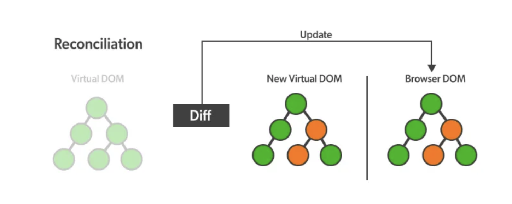

# Virtual DOM

실제 DOM과 같은 내용을 담고 있는 복사본이다.
복사본은 실제 DOM이 아닌 **JS 객체 형태**로 메모리 안에 저장된다.

Vitual DOM은 실제 DOM의 복사본으로 모든 `Element`와 속성을 공유한다.
차이점은 **브라우저에 있는 문서에 직접 접근할 수 없다는 점**이다.

## Vitual DOM을 사용하는 이유

다음 코드에서 DOM 조작이 이루어지는 과정을 알아보자.

```js
document.querySelector(‘#title”).style.color = “red”;
```

- 브라우저는 HTML을 탐색해 해당 `Element`를 찾고, 해당 `Element`와 자식 `Element`들을 DOM에서 제거
- 이후 새롭게 수정된 `Element`로 교체
- CSS는 이 과정 이후 다시 계산하여 레이아웃 정보를 알맞게 수정
- 새롭게 계산된 내용이 브라우저에 페인팅

이러한 DOM 조작 과정은 트리에 있는 정보를 업데이트한다는 점, 빠른 알고리즘을 사용한다는 점에서 그렇게 무리가 있는 작업은 아니다.
하지만 이를 반복적으로 수행했을 때 충분히 무거워질 수 있다.

이에 Virtual DOM이 등장하게 된 것이다.

Virtual DOM은 실제 브라우저에 접근하지 않는다.
Virtual DOM은 메모리에 저장되어 있는 자바스크립트 객체로 Virtual DOM에 접근하고 수정하는 것은 매우 가볍고 빠른 작업이 된다.

### Diffing

React에서는 두 개의 Virtual DOM 객체를 가진다.

1. 렌더링 이전 화면 구조를 나타내는 Virtual DOM
2. 렌더링 이후에 보이게 될 화면 구조를 나타내는 Virtual DOM



두 Virtual DOM을 비교하여 정확히 어떤 `Element`가 변했는지 확인한다.
이를 `Diffing`이라고 표현한다.

React는 차이가 발생한 부분만을 실제 DOM에 적용한다.
이 과정을 **Reconciliation**(재조정)이라고 한다.
여기서 **Batch Update**도 적용되어 작업이 매우 효율적으로 이루어지는 것이다.

정리하면 DOM 조작에 비용이 많이 들어가는 작업은 **브라우저에 화면을 그려주는 것**이다.
여기서 React는 변경된 `Element`를 별개로 그려주지 않는다.
**변경된 내용을 한 번에 받아와 이를 실제 DOM에 적용시켜준다는 점에서 효율적인 것**이다.

브라우저를 렌더링시키는 비용과 객체를 새로 만드는 비용을 비교해서 생각해봐도 좋을 것이다.

## Virtual?

> I wish we could retire the term “virtual DOM”.
> It made sense in 2013 because otherwise people assumed React creates DOM nodes on every render.
> But people rarely assume this today.
>
> “Virtual DOM” sounds like a workaround for some DOM issue. But that’s not what React is.

- DOM에 무언가 문제가 있어서 Virtual DOM을 사용하는 것이 아니다.
- Vitual DOM 대신 `Value UI`라는 단어를 권하고 있다.

## 나아갈 키워드

- dirty checking
- react fiber
  - [React Fiber Architecture](https://github.com/acdlite/react-fiber-architecture#what-is-a-fiber)

## 참고 문서

- [Virtual DOM (React) 핵심정리](https://callmedevmomo.medium.com/virtual-dom-react-%ED%95%B5%EC%8B%AC%EC%A0%95%EB%A6%AC-bfbfcecc4fbb)
- [virtual dom이 뭐가 좋은가? (feat.React fiber)](https://velog.io/@yesbb/virtual-dom%EC%9D%98-%EC%84%B1%EB%8A%A5%EC%9D%B4-%EB%8D%94-%EC%A2%8B%EC%9D%80%EC%9D%B4%EC%9C%A0)
