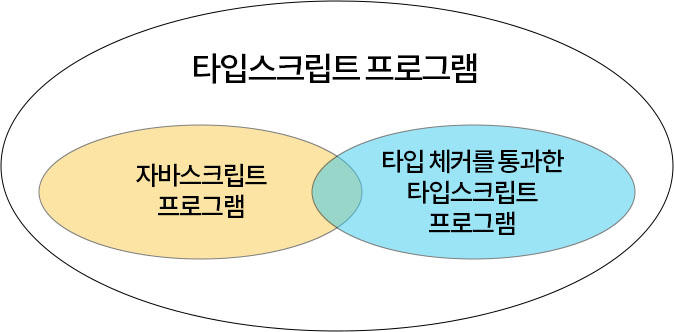
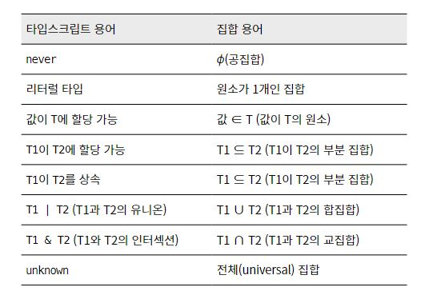

# 타입스크립트 집합의 관점으로 알아보기

[타입스크립트와 자바스크립트의 관계](#타입스크립트와-자바스크립트의-관계)
[타입스크립트와 런타임](#타입스크립트를-사용해도-런타임에서-오류가-날-수-있다)
[타입은 값들의 집합이다](#타입은-값들의-집합이다)
[타입의 집합 관점에서의 any](#집합-관점에서의-any)

## 타입스크립트와 자바스크립트의 관계

> item 1의 내용

_"타입스크립트는 자바스크립트의 상위집합(superset)이다."_



<br>

- 모든 자바스크립트 프로그램은 타입스크립트이다.
- 타입스크립트는 타입을 명시하는 추가적인 문법을 가진다.
- 모든 타입스크립트 프로그램은 자바스크립트가 아니다.

장점: 마이그레이션할 때 기존 코드를 유지하면서 일부분에만 타입스크립트를 적용할 수 있게 된다.

<br>

## 타입스크립트를 사용해도 런타임에서 오류가 날 수 있다.

> item 3의 내용

타입스크립트 타입 시스템의 기본 원칙은
**자바스크립트의 런타임 동작을 '모델링'하는 것이다.**

거기에 런타임 때 문제의 소지가 있을 만한 코드에 오류를 표시해주는 기능이 추가된 것이다.
하지만 타입스크립트가 모든 오류를 잡아준다고 잘못 생각할 수 있다.

```ts
const names = ['Alice', 'Bob']
console.log(names[2].toUpperCase())
```

이 예제는 타입스크립트에서도 자바스크립트에서도 문제가 없지만, 런타임에서는 `undefined`에 `toUpperCase` 프로퍼티가 없다는 에러가 뜬다.

타입스크립트의 타입 시스템이 정적 타입의 정확성을 보장해주지는 않기 때문이다.

<br>

## 타입은 런타임에 영향을 주지 않는다.

```ts
// 해당 ts 코드는 타입 체커를 통과한다.
function asNumber(val: number | string): number {
  return val as number
}

// 변환된 js
function asNumber(val) {
  return val
}
```

- 런타임에 영향을 주지 않는다는 말은, 런타임 성능에 영향을 주지 않는다는 뜻과 같다.
- 타입스크립트 컴파일러는 런타임 오버헤드는 없다. 대신에 빌드타임 오버헤드가 있다.
- 그러나 타입스크립트 버전이 올라갈수록 빌드타임 오버헤드가 거의 무시할 수준으로 떨어지고 있다.

<br>

## 타입은 값들의 집합이다.

> item 7의 내용

- 모든 변수는 런타임에 고유한 값을 가진다.
- 그러나 런타임 이전에는 모두 **'타입'** 을 가지고 있다.

### 타입의 범위

- 집합은 타입의 '범위'라고 부르기도 한다.
- ex) 모든 숫자값의 집합을 `number` 타입이라고 생각할 수 있다.
- 가장 작은 집합은 아무 값도 포함하지 않는 공집합이며, 타입스크립트에서는 `never` 타입이다.
- 공집합 다음으로 작은 집합은 한 가지 값만 포함하는 리터럴 타입(=유닛 타입)이다.

### 타입 묶기

- 타입스크립트 오류에서 가장 많이 보는 오류 중 하나는 "할당 가능한"이라는 문구의 오류다.
- "할당 가능한"은 집합의 관점에서 생각하면 이해하기 쉽다.
- "~의 원소(값과 타입의 관계)" 또는 "~의 부분 집합(두 타입의 관계)"을 의미한다.

  ```ts
  // 리터럴 타입 정의
  type A = 'A'
  type B = 'B'

  // 유니온 타입 사용
  type AB = A | B

  // 값 생성
  const a: AB = 'A'
  const B: AB = 'C' // ~ '"C"' 형식은 'AB' 형식에 할당할 수 없습니다.
  ```

  해당 오류는 _"{"C"}는 {"A", "B"}의 부분집합이 아닙니다."_ 라는 뜻과 같다.

<br>

```ts
interface Person {
  name: string
}
interface Lifespan {
  birth: Date
  death?: Date
}
type PersonSpan = Person & Lifespan
```

- `Person`과 `Lifespan`가 공통으로 가질 수 있는 속성이 없으니 `never` 타입일 것이라고 예상하기 쉽다.
- 그러나 값의 타입이 가질 수 있는 범위를 생각해야 한다.
- `Person`과 `Lifespan`의 합집합이 값 타입의 범위가 되기 때문에 `PersonSpan`은 `Person`도 갖고 `Lifespan`도 가져야 한다.
- 반대로 유니온 타입 연산이었다면 `Person`도 가져도 되고 `Lifespan`도 가져도 된다. 둘 중 하나만 가지면 된다.

<br>

### 💭 개인적인 생각

인터섹션과 유니온 계산은 마치 논리 연산자 `&&`와 `||`의 `true` 반환과 비슷하다고 생각한다. `&&` 비교 연산자가 두 개의 비교 대상이 **둘 다 truthy 한 값인지** 검사하는 것처럼, `&` 연산자는 두 타입을 전부 만족하는지를 검사한다. `|` 연산자 역시 `||` 연산자와 비슷하다.

<br>

### 타입스크립트 용어와 집합 용어



<br>

## 집합 관점에서의 `any`

> item 41의 내용

- 어떠한 타입이든 `any` 타입에 할당 가능하다.
- `any` 타입은 어떠한 타입으로도 할당 가능하다.
- 한 집합은 다른 모든 집합의 부분 집합이면서 동시에 상위집합이 될 수 없기 때문에, `any`는 타입 시스템과 상충되는 면을 가지고 있다. 즉, 문제를 일으키는 원인이 된다.

<br>

### `any` 타입이 문제가 되는 이유

`any` 타입을 무분별하게 사용할 경우(함수의 반환값, 타입 단언 등), 타입스크립트를 사용하는 이유가 사라져버린다. `any` 타입스크립트의 언어 서비스가 제공되지 않기 때문에 수많은 버그를 코드 곳곳에 전염병처럼 퍼뜨릴 수 있다.

```ts
interface Foo {
  foo: string
}
interface Bar {
  bar: string
}
declare function expressionReturningFoo(): Foo
function processBar(b: Bar) {
  /* ... */
}
function f1() {
  const x: any = expressionReturningFoo() // 어쩔 수 없이 any 타입 지정

  // 불가피하게 Bar 타입을 받는 함수에 Foo를 넣어야 함
  processBar(x)
  return x // 반환 타입이 any가 되어버림
}

function g() {
  const foo = f1() // 타입이 any
  foo.fooMethod() // 해당 값은 타입체크를 하지 않게 됨
  foo.first = '3' // 역시 없는 프로퍼티에도 접근할 수 있게 됨
}
```

<br>

## 타입 안전성을 유지하기 위한 타입 커버리지 추적

> item 44의 내용

```bash
npx type-coverage
npx type-coverage --detail
```

- 타입 커버리지 명령어를 입력하면 현재 프로젝트의 `any` 타입이 몇 개가 사용되고 있는지를 출력해준다.
- `--detail` 플래그를 붙이면 `any` 타입이 있는 곳을 모두 출력해 준다.
- 작성한 프로그램의 타입이 얼마나 잘 선언되었는지 추적하며 타입 안전성을 꾸준히 높이는 것이 좋다.

<br>

### `any`를 어떻게 방지하고 어떤 상황에서 어떤 식으로 작성해야 할지는 ...

이펙티브 타입스크립트 책을 읽으면 도움이 될 것이다 😀
